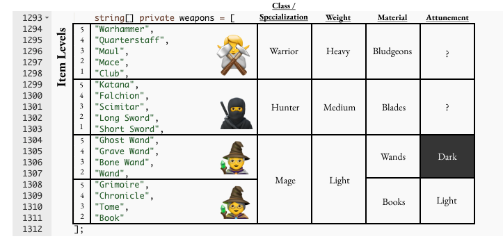
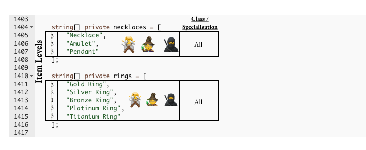

# Character Classes: Mages, Hunters, Warriors

While the "Character Classes" from the OG Loot contract are not explicitly named, the meaning of the groupings has come to be generally accepted by the Lootverse community as the following:

### (A) **Warrior** — items specialized for battle, fighting

### (B) **Hunter** — items specialized for hunting, taming, and ranger activities

### (C) **Mage** — items specialized for channeling magic
































This concept of naming these item specializations as "Warrior, Hunter & Mage" is the first canonical expansion on top of the core principles of the Loot contract.\
\
It is generally accepted as canon by everyone working in the Lootverse today. Over time, this may evolve and expand.

