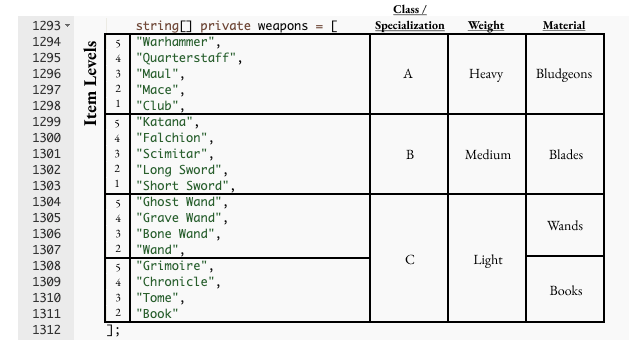
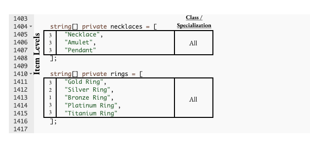

# Item Types

Hidden in the Loot contract, there is a clear structure and order to the items, beyond just a random assortment of "fantasy-themed" items.

_The screenshots below are directly from the_ [_OG Loot contract_](https://etherscan.io/address/0xff9c1b15b16263c61d017ee9f65c50e4ae0113d7#code)_, annotated by_ [_Timshel_](https://twitter.com/timshelXYZ/)__

Weapons fall into four categorie<strong>s</strong>

* Bludgeons
* Blades
* Wands
* Books

Armor falls into three categories

* Cloth
* Hide (Leather)
* Metal








.png>)






















